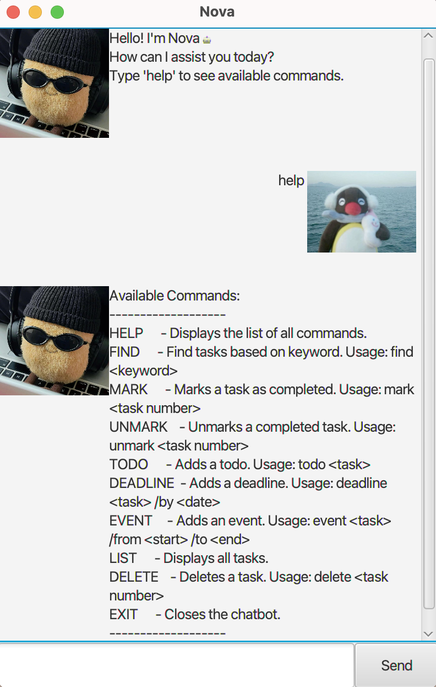

# Nova Chat box User Guide✨



Welcome to **Nova Chatbot** – your intelligent **CLI-based virtual assistant** 🧠! Nova helps you **manage tasks** efficiently using simple commands. Whether you're adding **todos, deadlines, or events**, this guide will help you get started.
# Table of Contents

- [Available Commands](#available-commands)
- [Features](#features)
- [FAQ](#faq)

# Available Commands

```plaintext
Available Commands:
HELP      - Displays the list of all commands.
FIND      - Find tasks based on keyword. Usage: find <keyword>
MARK      - Marks a task as completed. Usage: mark <task number>
UNMARK    - Unmarks a completed task. Usage: unmark <task number>
TODO      - Adds a todo. Usage: todo <task>
DEADLINE  - Adds a deadline. Usage: deadline <task> /by <date>
EVENT     - Adds an event. Usage: event <task> /from <start> /to <end>
LIST      - Displays all tasks.
DELETE    - Deletes a task. Usage: delete <task number>
BYE       - Closes the chatbot.
EXIT      - Exits the program.
```
# Features

## Adding a todo task: ```todo```
### Creates a task and add it to the list.
Format: `todo <task>`

Example: `todo borrow book`

Expected output:
```
Got it. I've added this task:
[T][ ] borrow book
Now you have 1 tasks in the list.
```

## Marking a task as done: ```mark```
### Mark a task in the task list as done.
Format: `mark <task index>`
- The `<index>` can be seen when using list command.
- The `<index>` has to be between 1 and the last number in the list.

Example: `mark 1`

Expected output:
```
Nice! I've marked this task as done:
[T][X] borrow book
```

## Unmarking a task as not done: ```unmark```
### Unmark a task in the task list as not done.
Format: `unmark <task index>`
- The `<index>` can be seen when using list command.
- The `<index>` has to be between 1 and the last number in the list.

Example: `unmark 1`

Expected output:
```
OK, I've marked this task as not done yet:
[T][ ] borrow book
```
## Adding a deadline task: ```deadline```
### Creates a deadline task and add it to the list.
Format: `deadline <task> /by <date>`
- The `<date>` has to be in `YYYY-MM-DD HH:MM` format.

Example: `deadline Submit report /by 2025-04-01 10:30`

Expected output:
```
Got it. I've added this task:
[D][] Submit report (by: Apr 1 2025 10:30am)
Now you have 2 tasks in the list.
```
## Adding an event task: ```event```
### Creates an event task and add it to the list.
Format: `event <task> /from <start> /to <end>`
- The `<date>` has to be in `YYYY-MM-DD HH:MM` format.
- The `<start>` has to be earlier then `<end>` date.

Example: `event Team outing /from 2025-05-10 10:30 /to 2025-05-12 10:30`

Expected output:
```
Got it. I've added this task:
[E][] Team outing (from: May 10 2025 10:30am to May 12 2025 10:30am)
Now you have 3 tasks in the list.
```

## Finds task base on keyword: ```find```
### Finds all the tasks where they have related keyword.
Format: `find <keyword>`

Example: `find book`

Expected output:
```
Here are the matching tasks in your list.
1.[T][] borrow book
```

## List tasks: ```list```
### List every single tasks that was stored.
Format: `list`

Example: `list`

Expected output:
```
Here are the matching tasks in your list.
1.[T][] borrow book
2.[D][] Submit report (by: Apr 1 2025 10:30am)
3.[E][] Team outing (from: May 10 2025 10:30am to May 12 2025 10:30am)
```

## Deleting a task: ```delete```
### Deletes the chosen tasks base on index number.
Format: `delete <task index>`
- The `<index>` can be seen when using list command.
- The `<index>` has to be between 1 and the last number in the list.

Example: `delete 3`

Expected output:
```
Noted. I've removed this task:
[T][] borrow book
Now you have 2 tasks in the list.
```

## Exit command: ```exit```
### Exits the application.
Format: `exit`

Example: `exit`

Expected output:
```
close window
```

## Bye command: ```bye```
### Closes the application.
Format: `bye`

Example: `bye`

Expected output:
```
Bye. Hope to see you again soon!
```
# FAQ

### Q1. Can I use uppercase commands?
**Answer:** Yes, you may use either lowercase, uppercase, or even mixed case.

### Q2. What happens if I enter an invalid command?
**Answer:** The app will prompt you with a guide towards the correct command. Otherwise, you can enter `help`
to see more options.

### Q3. Where is the data saved?
**Answer:** Once you launch the app, it will create a folder called `data`, which contains a `nova.txt`
file that will be reused.